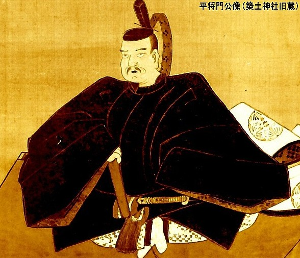

# 平将門
妙見信仰、稲荷鬼王神社、将門首塚、九曜紋

下総国坂東に将門が生まれたのは903年頃とされている。当時坂東は未開拓の地で、将門は将門は馬牧の経営と鉄製農具により、農民たちと開拓に取り組んだとされる。

藤原秀郷に打たれた後、将門は頭部を切断され京都に送られ、朝廷に逆らった朝敵としてさらし首にされる。
怪談では、「死後数か月たっても目を見開いていた」「故郷の東国へ飛んで行った」などと言われているが、梟首後に何者かが東国へ運んだとみるのが正解だろう。
その後将門の頭部は武蔵国豊島郡芝崎村まで運ばれ、その地に立つ神社（のちの神田明神）の近くに埋められたという。この地には下総を追われた将門の一族が住んでいたのかもしれない。

14世紀頃になると首塚周辺は荒廃が進んでおり、あたりでは疫病が蔓延し天変地異も多発していた。ちょうどそのころ、遊行中の他阿真教上人（時宗一遍の弟子）が立ち寄り、首塚を修復したところ疫病が収まったという。その後、首塚に隣接する神社に将門を合祀し、神田明神と名付けた。神田の由来は「神に供える稲を作る田があった」とも「胴塚（神田山）から胴体が移し葬られた」からともいわれている。

# 略歴
平安時代の関東の豪族。平治一族の抗争をきっかけに関東諸国を巻き込む争いに発展。新皇を自称したことから朝敵となり、藤原秀郷、平貞盛らに討伐された（平将門の乱）。

## 延命院
藤原秀郷によって討たれたとされる地に立つ寺。頭部を切断され、残された胴体をひそかに埋めたとされる胴塚（将門山、神田山とも）が境内にある。

## 国王神社
将門最後の合戦の時、三女は奥州恵日寺に逃れ、出家して如蔵尼と称しました。将門の死後33年目に郷里に戻り、この地に庵を結び、森の中から霊木を見つけ、一刀三拝して父将門の像を刻み、小祠を建てて安置し、将門大明神と号して祀られました。

## 神田明神
730年（天平2年）に真神田臣によって武蔵国豊島郡芝崎村（現在の千代田区大手町近辺）に創建された。
将門塚周辺で天変地異が頻発し、それが将門公の御神威として人々を恐れさせたため、時宗の遊行僧・真教上人が手厚く御霊をお慰めした。
1309年（延慶2年）に奉祀。1874年（明治7年）に摂社・将門神社に遷座されたが（昭和59年）に再び本殿に奉祀される。

## 鎧神社
平将門の鎧が埋められていると伝えられている。

## 稲荷鬼王神社
新宿の歌舞伎町にある神社で、宇賀能御魂命と鬼王権現（月夜見命、大物主命、天手力男命）を祭っている。
神社名に「鬼」の名が付いているが、古来「鬼」は神であり「力」の象徴でもあった。また、「鬼は悪慮を祓う」といわれることから、「鬼」から連想される悪いイメージを払拭するだけの力があるのだろう。

また一説には、平将門（幼名・鬼王丸）に所縁があったため、この名前が付けられたともされている。

賽銭箱には稲荷紋、巴紋とともに9つのマークが描かれている。それぞれのマークの中に漢数字が書かれているが、一と五が無く、八番が2つある。

## 筑土八幡神社
1616年に江戸城外堀拡張のため移転されてできた神社。将門の足が埋められているという噂もある。

## 筑土神社
築土神社の「相殿神（あいどののかみ）」である平将門公は、桓武天皇第五代の子孫で、幼少より文武両道に優れ朝廷のためにもよく尽くしていた。しかし父・良将が病死するに及んで一族間に内紛が起こりやがて拡大。将門公は東国の下総にて決起し、たちまちにして関東８カ国を平定。自ら「新皇」と称して政治に革新を図るも、天慶3年（940年）2月、平定盛と藤原秀郷の奇襲を受け、馬上刃刀に戦って壮絶な戦死をした。時に38歳の生涯であった。

将門公は、死後、東国においては英雄として祀り上げられるも、明治になると「皇国史観」（天皇への忠義を重んじる歴史観）の影響もあり、将門公を天皇に反抗した「逆賊」のように評する風潮も一部に見受けられた。そのため、築土神社では便宜上、「天津彦火邇々杵尊（あまつひこほのににぎのみこと）」を勧請してこれを「主神（しゅしん）」とし、他方で将門公は「相殿神」とされることとなった。

築土神社は940年(天慶3年)6月、関東平定後、藤原秀郷らの手で討たれ京都にさらされた平将門公の首を首桶に納め密かに持ち去り、これを武蔵国豊島郡上平河村津久戸(現・千代田区大手町周辺）の観音堂に祀って津久戸明神と称したのが始まりで、江戸城築城後の1478年（文明10年）6月には、太田道灌が江戸城の乾（北西）に当社社殿を造営。太田家の守護神、そして江戸城の鎮守神として厚く崇敬された。

[http://www.tsukudo.jp/gaiyou-masakado.html](http://www.tsukudo.jp/gaiyou-masakado.html)

## 兜神社
承平の乱(西暦935～940年)にて、藤原秀郷が平将門の首を打って京都へ運ぶ際、その平将門の打首に兜を沿えていたのですが、この地で罪滅ぼしにと兜だけ土中に埋め塚を作って供養したそうです。この塚を当時は兜山と呼んだそうですが、そこに兜神社が建ち、いつしか兜岩だけが残ったとのことです。

[https://www.ensenji.or.jp/contents/category/bosatsu/](https://www.ensenji.or.jp/contents/category/bosatsu/)

## 将門年表

* 903年 恒武天皇五代の子孫として生まれる。
* 935年 承平天慶の乱（～940年）
* 940年 藤原秀郷に打たれる
