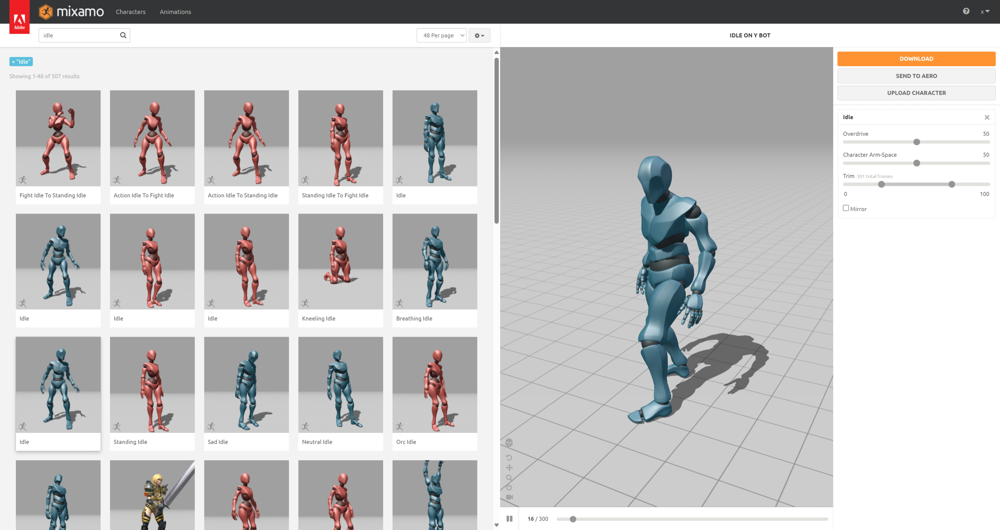
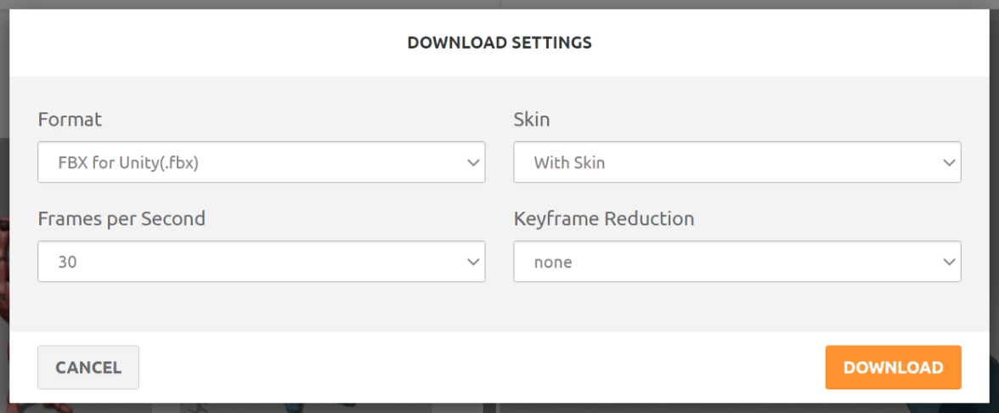
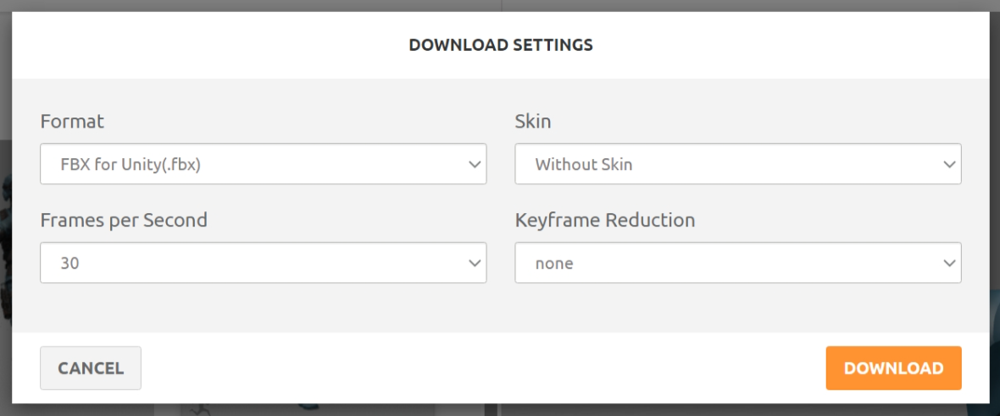
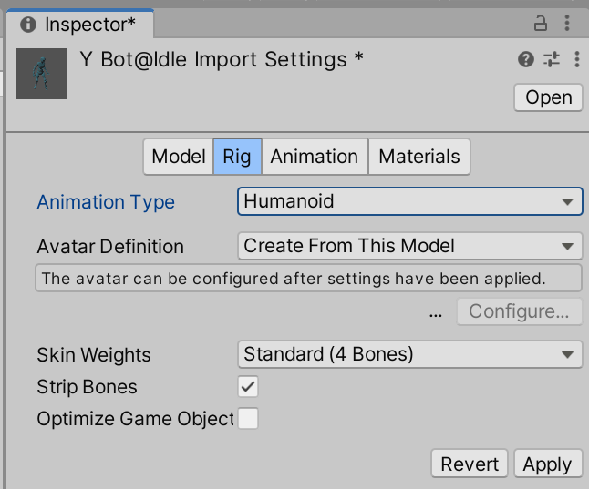
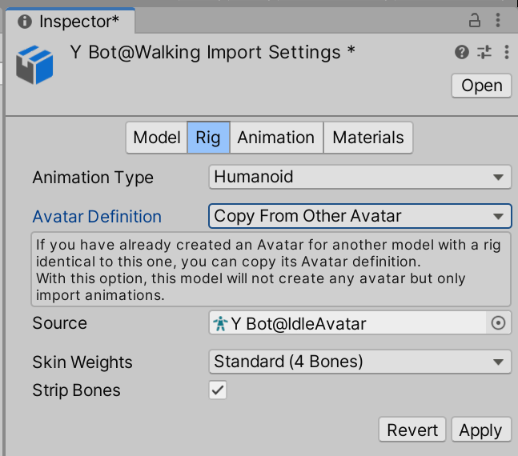
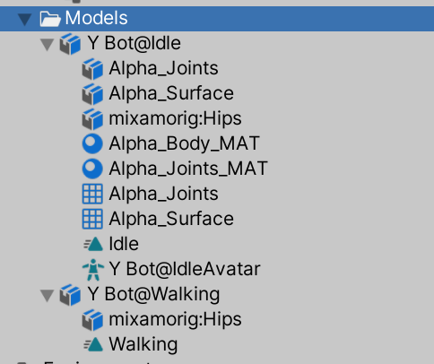
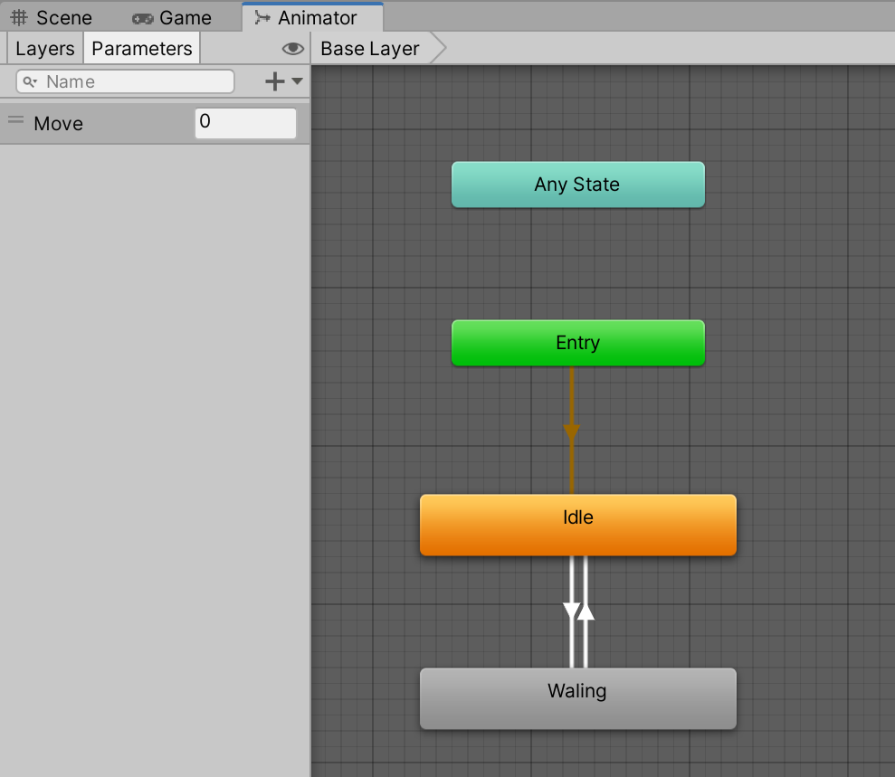
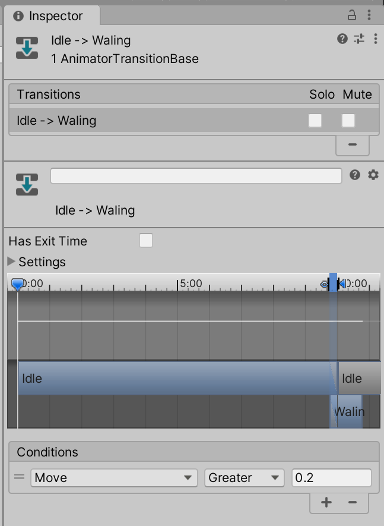
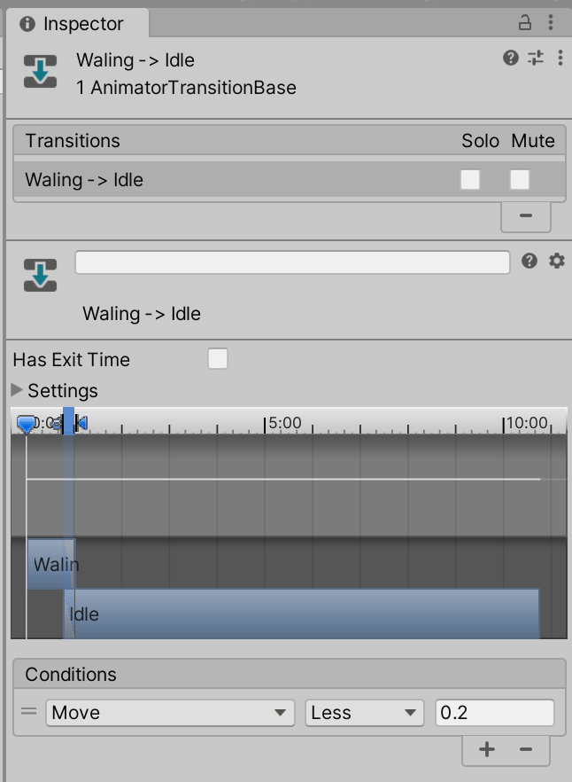

# Mixamoアニメーション

## 1

[Mixamo](https://www.mixamo.com/)にログインし、好きなアニメーションを選択する。画面ではIdle。

## 2

DOWNLOADボタンを押し、Formatを"FBX for Unity(.fbx)"、Skinを"With Skin"にしてダウンロードする。

## 3

別のアニメーションを選択し、Skinを"Without Skin"[^1]にしたデータをダウンロードする。

[^1]: With Skinでも問題はないが、無駄なデータを含まなくて済む。

## 4

ダウンロードした2つのFBXをUnityにインポートし、1つ目のFBXのインポート設定ではRigのAnimation Typeで"Humanoid"、Avatar Definitionで"Create From This Model"を選択、さらにAnimationの"Loop Time"にチェックしてApplyする。

## 5

2つ目のFBXでも基本的に蒸気と同じ設定とするが、RigのAvatar Definitionでは"Copy From Other Avatar"を選択し、Sourceに上記で作成されたAvatarを選択する。

## 6

上記手順が完了すると下記のようなAnimation Clipが生成される（Y Bot@Idleが2つ目、Y Bot@Walkingが2つ目）。

## 7

Animator Controllerを作成し、ParametersにFloat型の変数を1つ作成する。さらに2つのStateを追加し画像のように接続する。

## 8

Idle StateのMotionには4項で生成されたAnimation Clipを、Walking StatekのMotionには5項で生成されたAnimation Clipをそれぞれ選択する。

## 9

Idle->WalkingのTransitionではHas Exit Timeのチェックを外し、Conditionsに7項で作成したFloatが0.2以上になったら、という条件を設定する。Waling->Idleの条件はFloatが0.2以下の条件とする。

