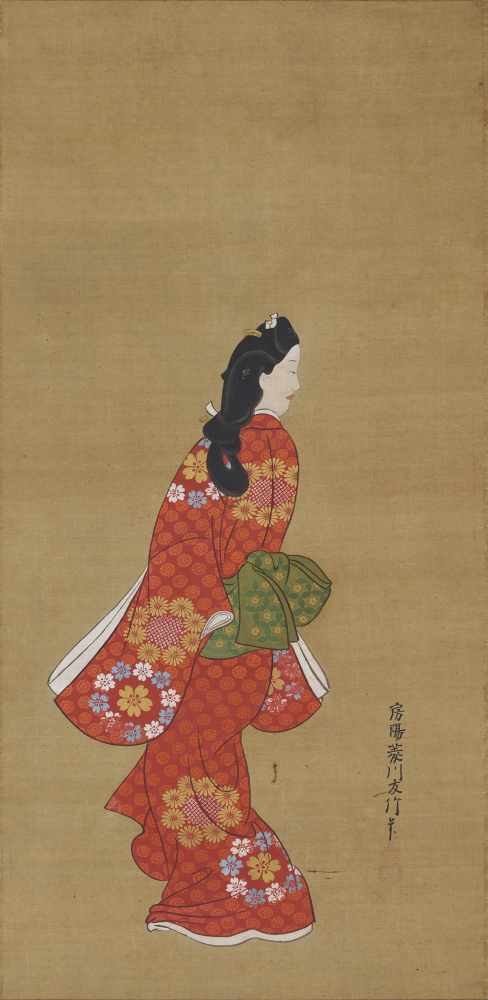

# 浮世絵師

## 鳥山石燕（とりやま せきえん）

狩野派の絵師。人物の描写を得意とし、ことさら妖怪画に名を博した。『百鬼夜行』(1776)、『続百鬼』(1779)、『百鬼拾遺』(1781)、『画図百鬼徒然袋』(1784)など。

## 菱川師宣（ひしかわ もろのぶ）

浮世絵文化の創始者ともいえる人物で、それまで挿絵でしかなかった浮世絵を一枚絵の芸術作品にまで高めた立役者である。また、浮世絵を木版画によって大量生産したことで、庶民に身近な娯楽として楽しめるようにもした。

代表的な作品として「見返り美人図」や「歌舞伎図屏風」などがある。

## 横山崋山（よこやま かざん）

江戸時代後期に京都で活躍した浮世絵師。諸画派に属さず、画壇の潮流に左右されない自由な画風と筆遣いで人気を博した。

## 鳥居清信（とりい きよのぶ）

## 鳥居清倍（とりい きよます）

## 懐月堂安度（かいげつどう あんど）

## 宮川長春（みやがわ ちょうしゅん）

## 奥村政信（おくむら まさのぶ）

## 鈴木春信（すずき はるのぶ）

## 磯田湖龍斎（いそだ こりゅうさい）

## 一筆斎文調（いっぴつさい ぶんちょう）

## 北尾重政（きたお しげまさ）

## 勝川春章（かつかわ しゅんしょう）

## 歌川豊春（うたがわ とよはる）

歌川派の祖。

## 鳥居清長（とりい きよなが）

## 喜多川歌麿（きたがわ うたまろ）

## 東洲斎写楽（とうしゅさい しゃらく）

寛政6年（1794）5月から1年に満たない期間で約140枚の錦絵を残して消えた謎の絵師。

## 鳥文斎栄之（ちょうぶんさい えいし）

## 勝川春英（かつかわ しゅんえい）

## 歌川豊国（うたがわ とよくに）

豊春に弟子入りした歌川派初期の絵師。国定や国芳など「国」を与えた師。

## 歌川国政（うたがわ くにまさ）

## 歌川豊広（うたがわ とよひろ）

豊春に弟子入りした歌川派初期の絵師。広重の師。

## 鍬形蕙斎（くわがた けいさい）

## 葛飾北斎（かつしか ほくさい）

## 菊川英山（きくかわ えいざん）

## 渓斎英泉（けいさい えいせん）

## 歌川国貞（うたがわ くにさだ）

三大豊国。

## 歌川国芳（うたがわ くによし）

落合芳幾、月岡芳年の師。

## 歌川広重（うたがわ ひろしげ）

『東海道五十三次』が代表。

## 歌川貞秀（うたがわ さだひで）

## 河鍋暁斎（かわなべ きょうさい）

## 落合芳幾（おちあい よしいく）

## 月岡芳年（つきおかよしとし）

歌川国芳の弟子で、幕末から明治前半に活動。残酷な殺戮画や死骸など「血みどろ絵（無残絵）」と称されるジャンルを手掛けた。

## 豊原国周（とよはら くにちか）

## 小林清親（こばやし きよちか）
