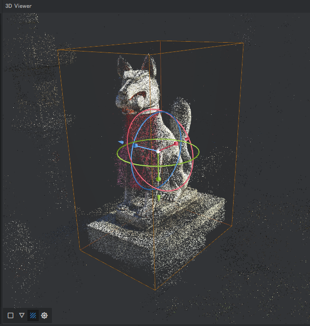

# 概要
AliceVisionをベースにしたフォトグラメトリソフト。

[https://alicevision.org/](https://alicevision.org/)

ソフトを起動すると以下のような画面が表示される。


1. Images - 使用する画像一覧エリア
2. Image Viewer - 画像のプレビューエリア
3. 3D Viewer - 生成された3Dオブジェクト表示エリア
4. Graph Editor、Task Manager - ノード・ノード処理状況表示エリア
5. Node - ノードのプロパティ設定エリア

# 使い方

## 画像の用意

使用する画像を複数枚用意する。

今回使用した画像: [/assets/sample/images](assets/sample/images)

## 設定

用意した画像をImagesエリアにドラッグ&ドロップすると、Graph Editorにデフォルトのパイプラインが生成される。それぞれのノードをクリックするとプロパティを設定できる。また、Graph Editorエリアを右クリックしてノードを追加できる。

1. CameraInit - カメラの初期設定
2. FeatureExtraction - 画像から特徴点を抽出する
3. ImageMatching - 画像のマッチング
4. FeatureMatching - 特徴点のマッチング
5. StructureFromMotion - 画像の3D空間の位置を推定する
6. PrepareDenseScene - ゆがみを取り除いた画像を生成する
7. DepthMap - デプスマップを生成する
8. DepthMapFilter
9. Meshing - メッシュを生成する
10. MeshFiltering - 不要なメッシュを削除する
11. Texturing - テクスチャを生成する

Node Reference: [https://meshroom-manual.readthedocs.io/en/latest/feature-documentation/nodes/](https://meshroom-manual.readthedocs.io/en/latest/feature-documentation/nodes/)

## 処理

上部のStartボタンを押すと処理が開始する。処理中の状況はGraph EditorおよびTask Manager画面にリアルタイムで表示される。

それぞれのノードで生成されたデータはMeshroomCacheフォルダに保存される。それぞれのノードを右クリックし「Open Folder」を選択するとフォルダが開く。

オリジナルの画像（左）とPrepareDenseSceneで処理された画像（右）の比較。


DepthMapで生成された画像（左）とDepthMapFilterで処理された画像（右）の比較。


Meshingで生成されたメッシュ（左）とMeshFilteringで処理されたメッシュ（右）の比較。MeshFilteringで処理することで、ノイズとなっているメッシュが削除される。


Texturing後、最終的に生成されたデータ。


## ノードの修正

生成されたメッシュには本来必要とする対象物以外のデータも含まれてしまうので、対象物のみのメッシュを生成するようにノードを修正する。

Meshingノードを選択し、プロパティから「Custom Bounding Box」にチェックを入れる。
{ width="500px" }

Meshingノードをダブルクリックすると3D Viewerエリアにバウンディングボックスが生成される。バウンディングのサイズ、位置を調整し必要なオブジェクトだけを囲むようにする。
{ width="300px" }

Meshingノードを右クリックし「Compute」を選択すると、ノードの処理が再実行される。

最終的に生成された3Dモデルデータ: [/assets/sample/model](assets/sample/model)


## ノードのキャッシュ

ノードのパラメータを変更すると、それ以降のノードは再実行が必要になる。ただし、元々のプロパティで実行したデータはキャッシュとして残る。

例えば、MeshFilteringノードのプロパティSmooting Iterations=5で実行した場合、そのデータはキャッシュとして残る（画像上）。Smooting Iterationsを6に変更するとプログレスバーがグレーになり、ノードの再実行が必要になる（画像下）が、Smooting Iterationsを5に戻せば画像上の状態に戻る。


# Tips

## 動画を素材として使用する

対象物が壁面などの場合には周囲を回る必要がないため、写真ではなく動画のほうが撮影しやすいことがある。

動画を素材として使用するには動画から静止画を生成する必要がある。1つの方法として、FFmpegで下記のようなコマンドを実行すると連番画像が作成できる。

```
# ffmpeg -i <入力ファイル名> -vcodec mjpeg -r <出力FPS> <出力ファイル名>

ffmpeg -i input.mp4 -vcodec mjpeg -r 10 image_%03d.jpg
```

FFmpeg: [https://ffmpeg.org/](https://ffmpeg.org/)

動画から作成した3Dモデルデータ。


## メッシュのリトポロジー

メッシュを軽量化する場合、MeshDecimateノードやMeshResamplingノードを使用することもできるが、Instant Meshesなど別のソフトを使用したほうがきれいなメッシュを生成しやすいかもしれない。

Meshroomで生成されたメッシュ（左）とInstant Meshesで処理したメッシュ（右）の比較。


Instant Meshes: [https://github.com/wjakob/instant-meshes](https://github.com/wjakob/instant-meshes)

# トラブルシューティング

## memory exhausted

Texturingノード実行時に「Abnormal program termination: memory exhausted」が発生した。

メモリ不足が原因と思われる。プロパティのTexture SideやTexture Downscaleの値を変える、もしくはメモリの空きを増やすために、他に起動しているアプリの終了やOS再起動等を試す。
