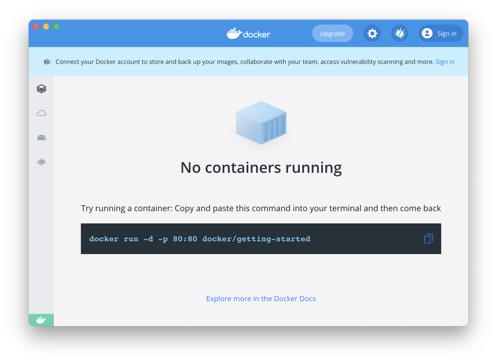
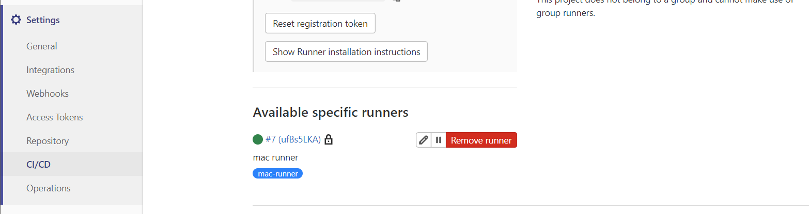
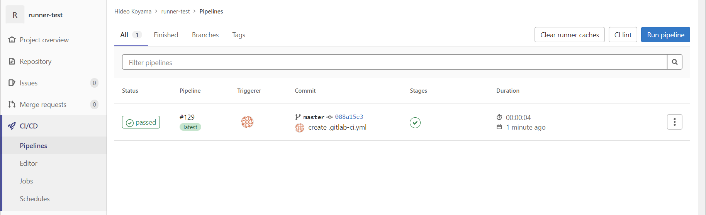
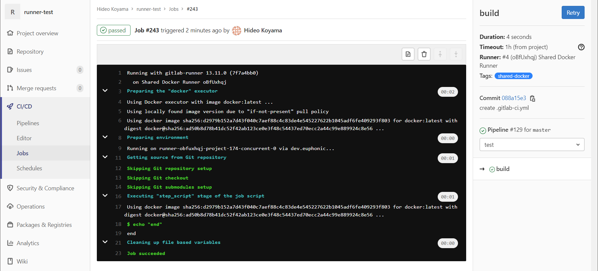
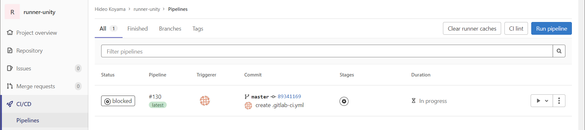
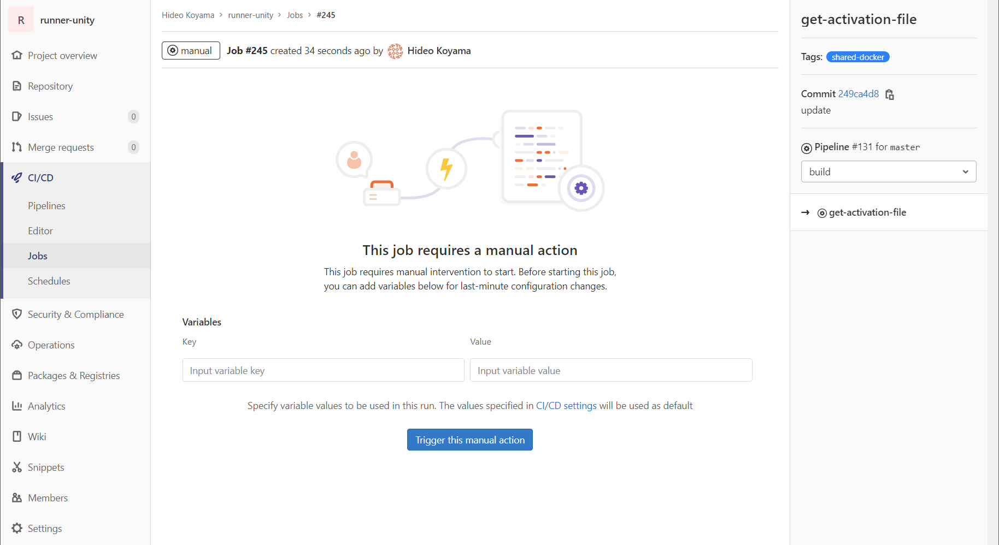
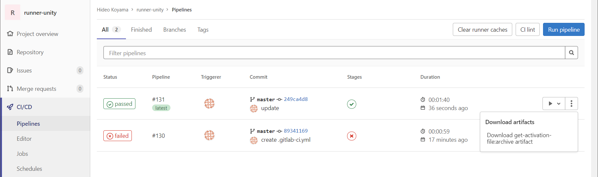
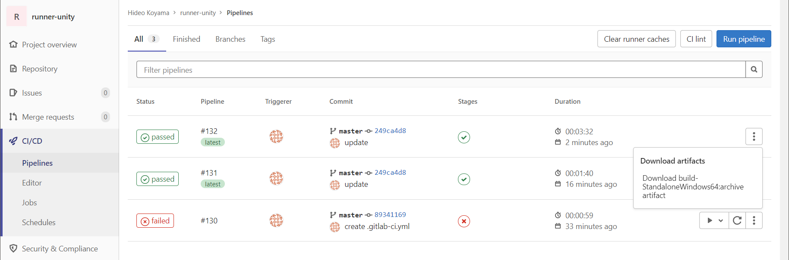

# GitLab Runnerとは
GitLab Runnerとは、GitLab環境でCI/CDを利用するためのツール。

CI/CD（継続的インテグレーション/継続的デプロイ）とは、テストやビルドを自動的に実行するための仕組みで、GitLab Runnerを利用すると、GitにPushしたタイミング等でCI/CDを実行できるようになる。

## GitLab Runnerの種類

GitLab Runnerには、どのプロジェクトからでも使用できる"Shared Runner"と、プロジェクトごとに構築して使用する"Specific Runner"がある（共有か専有かの違いだけでできることは一緒）。

# 構築
macでUnityビルド（ipaファイル生成）をする場合には、下記手順の環境構築が必要になる。

1. Dockerをインストール
2. gitlab-runnerをインストール
3. gitlab-runnerを登録
4. .gitlab-ci.ymlを作成

## Dockerインストール
下記Docker公式ページから、Docker Desktop for Macをインストールする。  
[https://www.docker.com/](https://www.docker.com/)



Dockerのインストールが完了後、ターミナルで`docker version`を入力し、バージョンが表示されることを確認する。

## GitLab Runnerインストール
下記GitLab公式ページを参考にGitLab Runnerをインストールする。  
[https://docs.gitlab.com/runner/install/osx.html](https://docs.gitlab.com/runner/install/osx.html)

```
brew services restart gitlab-runner
brew services
```

GitLab Runnerインストール後、ターミナルで下記コマンドを入力し、RunnerをGitLabに登録する。
```
gitlab-runner register
Enter the GitLab instance URL (for example, https://gitlab.com/):
https://git.euphonic.co.jp/
Enter the registration token:
***
Enter a description for the runner:
[epnoMacBook-Air.local]: mac runner
Enter tags for the runner (comma-separated):
mac-runner
Registering runner... succeeded                     runner=n8xx5_T3
Enter an executor: docker, docker-ssh, shell, ssh, virtualbox, docker-ssh+machine, custom, parallels, docker+machine, kubernetes:
shell
Runner registered successfully. Feel free to start it, but if it's running already the config should be automatically reloaded!
```

上記登録後、GitLabのSpecific Runnerに登録されたことを確認する。



# 使用方法
GitLab Runnerを使用するには.gitlab-ci.ymlというGitLab CI/CDパイプラインファイルが必要になる。同ファイルをプロジェクトルートディレクトリに作成すると、サーバにPushしたタイミング等でパイプラインに記載された処理が実行される。

## GitLab CI/CD画面構成
最小構成として下記のようなパイプラインを作成する。下記は単純に"end"を表示するだけのパイプライン。

```.gitlab-ci.yml
build:
  tags:
    - shared-docker
  script:
    - echo "end"
```

対象プロジェクトのメニューからCI/CD > Pipelinesを選択すると、パイプラインの実行履歴が表示される。



Statusのアイコンをクリックすると実行履歴の詳細が確認できる。



[GitLab CI/CD パイプライン設定リファレンス](https://gitlab-docs.creationline.com/ee/ci/yaml/)

## Unityビルド
Shared Runnerを使用してUnityビルドするには、[GitLabWeb](https://emp.euphonic.co.jp/gitlab/)上でいくつか設定が必要になる。

対象プロジェクトのメニューからSettings > CI/CDを選択し、Variables下記のKeyValueを追加する。

* SSH_PRIVATE_KEY: GitLabに登録しているSSH Private Key
* UNITY_USERNAME: Unityアカウント名
* UNITY_PASSWORD: Unityアカウントのパスワード

### Unityライセンス認証
Specific Runnerでパイプラインを実行すると"get-activation-file"で一時停止するので、"Trigger this manual action"ボタンを押して処理を再開させる。





正常に処理が終了すると、パイプライン画面からartifactsファイルがダウンロードできるようになるので、ファイルをダウンロードする。



ダウンロードしたzipファイルを解凍するとunity3d.alfが入っているので、下記ライセンス認証ページにアクセスし、unity3d.alfをアップロードして認証する。正常に認証できるとUnity_v2020.x.ulfファイルがダウンロードできるようになる。

[https://license.unity3d.com/manual](https://license.unity3d.com/manual)

対象プロジェクトのメニューからSettings > CI/CDを選択し、Variables下記のKeyValueを追加する。

* UNITY_LICENSE: Unity_v2020.x.ulfの中身をそのまま貼り付け

上記UNITY＿LICENSEを設定した後にパイプラインを実行するとビルドプロセスが実行され、正常に処理が完了するとビルドしたファイルがダウンロードできるようになる。


